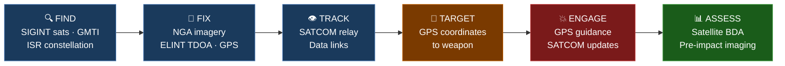
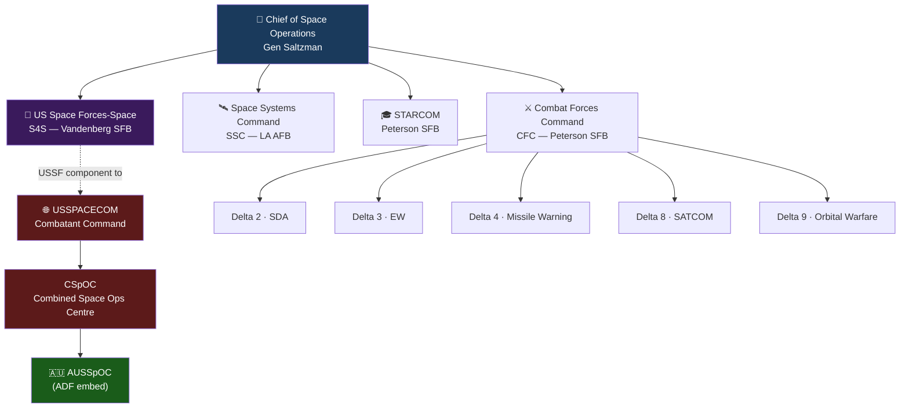
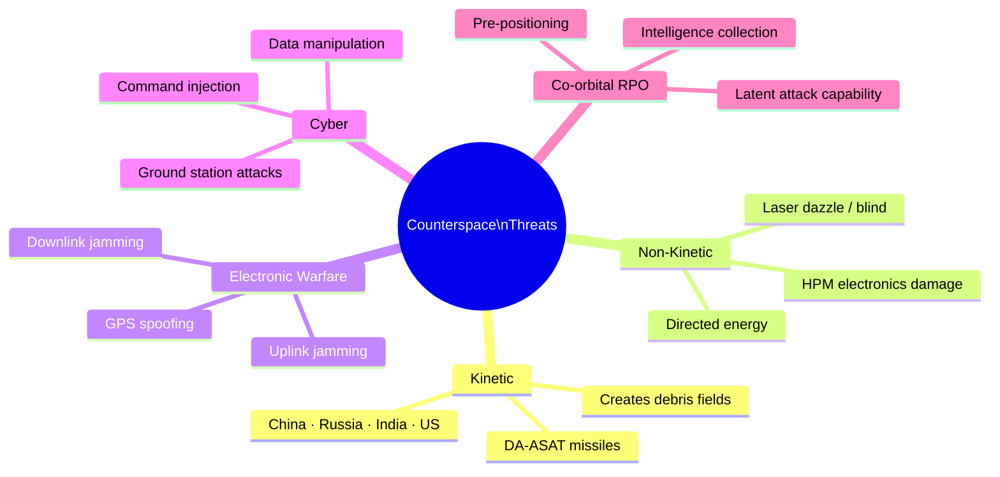
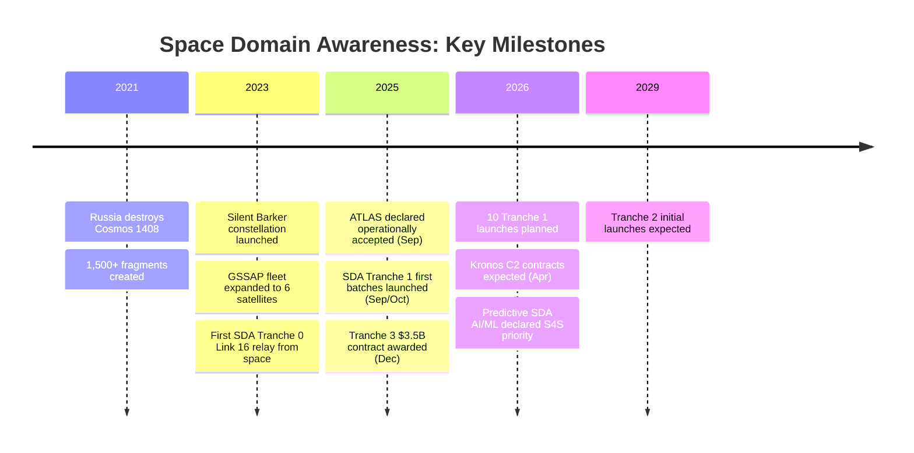

# Interactive Features Demo

> [!info] About This Note
> This note demonstrates the interactive and visual features in this vault. Features marked 🟢 **Native** work out of the box in any Obsidian install. Features marked 🔵 **Plugin** use one of the three community plugins already bundled in this vault — **Dataview**, **Spaced Repetition**, and **Charts** — which activate automatically on first open.

---

## 🟢 Mermaid Diagrams — Native

Obsidian renders [Mermaid.js](https://mermaid.js.org) diagrams natively. No plugins required.

### Flowchart — F2T2EA Kill Chain



> [!tip] Every coloured node in the kill chain has a dedicated note. Click through to [[Space-Based Targeting]], [[GMTI and AMTI]], or [[GPS]].

---

### Graph — USSF Command Structure



---

### Mind Map — Counterspace Threat Taxonomy



---

### Timeline — SDA Architecture Evolution



---

## 🟢 Collapsible Callouts — Native

Add a `-` after the callout type to make it **collapsed by default**. A `+` forces it open. This is useful for CLAs or supplementary detail you don't want to show every reader immediately.

> [!warning]- Constraints, Limitations and Assumptions *(click to expand)*
> **Constraints:** Mermaid diagrams render in Obsidian's Preview/Reading mode — they appear as raw code in source/editing mode.
>
> **Limitations:** Complex diagrams with many nodes can become slow to render. Mermaid's timeline diagram type requires Obsidian v1.4+.
>
> **Assumptions:** Assumes Obsidian is up to date — older versions may not support all Mermaid diagram types shown here.

> [!example]- Example: Collapsible Hot Tip *(click to expand)*
> This tip is hidden by default — useful when you want to preserve the "think before you peek" discipline for self-study. The `-` suffix collapses it; a `+` suffix forces it open even if the user has previously closed it.

---

## 🟢 Self-Test Checkboxes — Native

Obsidian renders interactive checkboxes. These persist their state — checking one actually saves to the file.

### Knowledge Check: Space Fundamentals

Complete these without looking at your notes:

- [ ] Name the three unique military advantages of space
- [ ] What is the Kármán line altitude?
- [ ] What does USSF stand for, and when was it established?
- [ ] Name the four USSF Field Commands and their HQ locations
- [ ] What is the difference between USSF and USSPACECOM?
- [ ] What are the five counterspace threat categories?
- [ ] Why does WGS have a critical SATCOM vulnerability?
- [ ] What GNSS signal does the Shahed-136 use — and why does that matter?

> [!tip]- Answers *(click to reveal)*
> 1. Persistence, Global Reach, Speed
> 2. 100 km (Kármán line)
> 3. United States Space Force, established 20 December 2019
> 4. CFC (Peterson), SSC (LA AFB), STARCOM (Peterson), S4S (Vandenberg)
> 5. USSF organises/trains/equips; USSPACECOM employs forces operationally
> 6. Kinetic DA-ASAT, Directed Energy, Electronic Warfare, Cyber, Co-orbital RPO
> 7. WGS has no anti-jam protection — it is the most exploitable SATCOM vulnerability
> 8. GLONASS — GPS jamming has zero effect on GLONASS-guided munitions

---

## 🟢 Note Transclusion — Native

Obsidian can embed (transclude) any note or section inline using `![[Note]]`. This means you can build a "dashboard" that pulls live content from multiple notes without duplicating it.

**Example** — the quick reference table from [[Key Systems Quick Reference]] can be embedded anywhere:
```
![[Key Systems Quick Reference]]
```
*(Remove the backticks and the table renders live inline.)*

You can also embed specific headings:
```
![[SATCOM Architecture#WGS (Wideband Global SATCOM)]]
```

---

## 🔵 Dataview — Study Dashboard

> [!info] Requires Plugin
> Install **Dataview** via Obsidian Settings → Community Plugins → Browse → search "Dataview". Free and open source.

Once installed, queries like this generate **live, dynamic tables** from your note frontmatter:

### All Foundational Notes
````
```dataview
TABLE prerequisites, tags
FROM "" WHERE difficulty = "Foundational"
SORT file.name ASC
```
````

### All Advanced Notes (sorted by section)
````
```dataview
TABLE difficulty, prerequisites
FROM "" WHERE difficulty = "Advanced"
SORT section ASC
```
````

### Notes by Tag
````
```dataview
TABLE file.name AS "Note", difficulty
FROM #counterspace OR #SDA
SORT difficulty ASC
```
````

### Reading Progress Tracker
````
```dataview
TASK FROM ""
WHERE !completed
GROUP BY file.link
```
````
*(This lists all unchecked checkboxes grouped by note — turns your self-test checklists into a live progress tracker.)*

---

## 🔵 Spaced Repetition Flashcards

> [!info] Requires Plugin
> Install **Obsidian Spaced Repetition** (by st3v3nmw) via Community Plugins.

Any note can contain flashcards using `::` (inline) or `?` (block) syntax. These integrate with a spaced repetition algorithm for active recall training.

**Inline cards** (term :: definition):
```
DA-ASAT :: Direct-Ascent Anti-Satellite missile — physically destroys a satellite, creating debris
MUOS :: Mobile User Objective System — 5 GEO satellites, 3G-like UHF SATCOM, AUS hosts one of four ground stations
CSpOC :: Combined Space Operations Centre — the coalition watch floor at Vandenberg SFB
F2T2EA :: Find, Fix, Track, Target, Engage, Assess — the kill chain framework
```

**Block cards** (question on one line, `?` separator, answer below):
```
What makes WGS critically vulnerable?
?
WGS has no anti-jam protection — it operates in unprotected X/Ka band. A threat actor with a
directional jammer and knowledge of the satellite's location can deny it without any space capability.
```

---

## 🔵 Charts

> [!info] Requires Plugin
> Install **Obsidian Charts** via Community Plugins.

Renders inline bar, line, pie, and radar charts from YAML data blocks. Example use: threat actor capability radar chart, orbital debris growth over time, satellite count by constellation.

```chart
type: radar
labels: [Kinetic ASAT, Directed Energy, EW/Jamming, Cyber, Co-orbital RPO]
series:
  - title: China
    data: [5, 4, 4, 5, 5]
  - title: Russia
    data: [5, 3, 5, 4, 4]
  - title: Iran
    data: [2, 1, 4, 3, 1]
width: 60%
```
*(Requires Charts plugin to render — appears as a radar chart comparing counterspace capability by domain.)*

---

## What's Already Implemented in This Vault

| Feature | Where |
|---|---|
| Mermaid F2T2EA flowchart | [[Space-Based Targeting]] |
| Mermaid USSF org chart | [[USSF Organisation]] |
| Collapsible CLAs | All content notes (change `[!warning]` to `[!warning]-`) |
| Self-test checkboxes | This note — copy the format to any topic note |
| Dataview dashboard | [[Study Dashboard]] |

---

**Related:** [[Space Operations Reference — Map of Content]] · [[Study Dashboard]] · [[Key Systems Quick Reference]]
