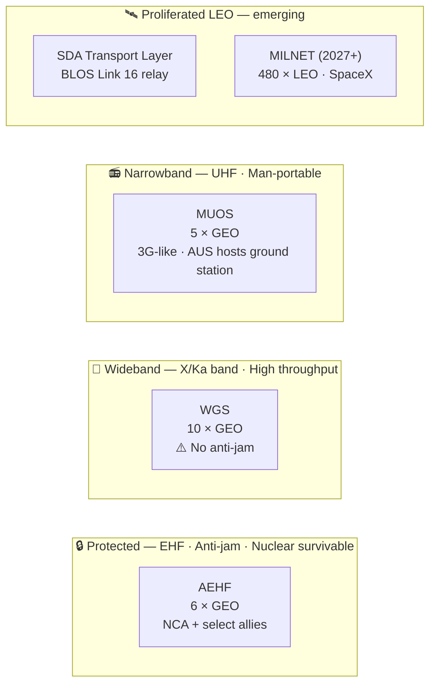

# SATCOM Architecture

> [!abstract] Quick Summary
> Describes the narrowband, wideband, and protected SATCOM architecture — WGS, AEHF, and MUOS — that the joint force and ADF depend on for command, control, and ISR relay. Knowing which system serves which user tier is critical for understanding SATCOM resilience and vulnerability.


    style Protected fill:#5c1a1a,color:#fff
    style Wideband fill:#1a3a5c,color:#fff
    style Narrowband fill:#1a5c1a,color:#fff
    style LEO fill:#3a3a00,color:#fff
```

## Narrowband (NB)

- **Frequency**: UHF (300 MHz–3 GHz)
- **Data rate**: 5–64 kbps per channel
- **Terminals**: small, man-portable
- **Use cases**: voice, C2, foliage-penetrating
- **Systems**: [[MUOS]], [[ADF SATCOM Systems|Intelsat IS-22]], [[ADF SATCOM Systems|Optus C1]] UHF

## Wideband (WB)

- **Frequency**: X-band (8–12 GHz) and Ka-band (26.5–40 GHz)
- **Data rate**: Mbps–Gbps aggregate
- **Terminals**: large
- **Use cases**: FMV, imagery, high-rate data
- **Primary system**: [[WGS]]

---

## WGS (Wideband Global SATCOM)

- 10 operational satellites (2024), Boeing BSS-702 bus, each ~5,987 kg
- **WGS-11+**: Scheduled for launch **late 2026** aboard Vulcan Centaur; provides 2x the capacity of the entire previous WGS constellation and hosts the **Protected Tactical SATCOM Prototype (PTS-P)**.
- [[Orbital Mechanics|GEO]] distributed over Pacific, Indian, Atlantic Oceans
- ~4.875 GHz instantaneous bandwidth with X/Ka cross-banding onboard

---

## AEHF (Advanced Extremely High Frequency)

- 6 satellites in [[Orbital Mechanics|GEO]]; nuclear survivable NC3 backbone.
- **Evolved Strategic SATCOM (ESS)**: Boeing awarded $2.8B contract (July 2025); $1.29B requested in FY2026 budget. Successor to AEHF; first delivery expected **2031**.

---

## MUOS (Mobile User Objective System)

- 5 satellites in [[Orbital Mechanics|GEO]] (4 operational + 1 spare); US Navy-led
- **Service Life Extension (SLE)**: USSF down-selecting provider in **FY2026** for MUOS-6 and MUOS-7; launches expected ~2030 to extend service through 2035.
- 4 ground stations globally:
  - **[[Australia Space Contribution|Kojarena]] (Australia)** 🇦🇺
  - Niscemi (Sicily) 🇮🇹
  - Northwest (Virginia) 🇺🇸
  - Wahiawa (Hawaii) 🇺🇸
- 3G-like mobile connectivity; WCDMA waveform
- Up to **384 kbps** per user vs ~2.4 kbps legacy UHF
- Australia hosts one of only **four** MUOS Radio Access Facilities globally

> [!tip] Hot Tip
> Australia hosts one of only four MUOS Radio Access Facilities globally (Kojarena, WA) — this gives ADF a strategic asset that peers value and that would be a high-priority adversary target in conflict. Awareness of Kojarena's role should inform both ADF force protection planning and ADF's negotiating position in coalition SATCOM agreements.

---

> [!warning]- Constraints, Limitations and Assumptions
> **Constraints:** AEHF is restricted to National Command Authority and select users — ADF access is limited. MUOS requires WCDMA-capable terminals — legacy UHF radios need a gateway to access MUOS capacity.
>
> **Limitations:** WGS bandwidth is finite and heavily contested during exercises and operations — expect congestion. AEHF has limited capacity and cannot support mass user populations. GEO satellites are visible from fixed ground positions — predictable geometry enables jamming from known locations.
>
> **Assumptions:** Assumes WGS-6 remains accessible to ADF through current agreements to approximately 2029. Assumes ground segment infrastructure (Kojarena, SGS-West) remains operational and untargeted.

**Related:** [[ADF SATCOM Systems]] · [[RF Spectrum Reference]] · [[Satellite Jamming Techniques]] · [[Australia Space Contribution]]
