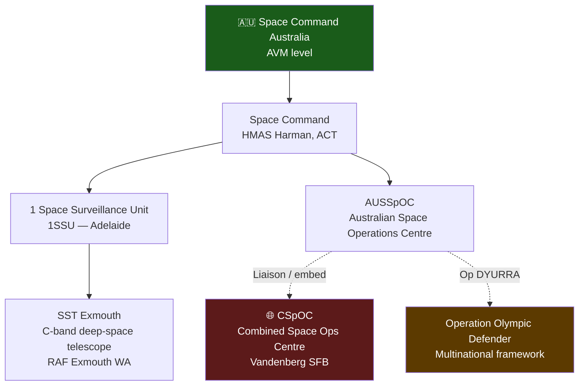

# ADF Space C2

> [!abstract] Quick Summary
> Describes Australia's space command and control architecture — from Space Command Australia down to 1SSU and AUSSpOC — and how it integrates with USSPACECOM and coalition partners through Op DYURRA and the CSpOC embed.

## Space Command (SPACECOMD)

- Under Joint Capabilities Group
- Commander: **Maj Gen Greg Novak AM**
- Four mission areas: [[Space Domain Awareness|SDA]], [[SATCOM Architecture|SATCOM]], ISR, Space Control

## Key Units and Nodes

### No. 1 Space Surveillance Unit (1SSU)
- HQ: Edinburgh SA
- Operates C-Band Radar and [[SST Exmouth|SST]] at Exmouth WA
- Commercial Data Mission Centre at Lot 14, Adelaide
- First joint space unit; established **January 2023**

### AUSSpOC (Australian Space Operations Centre)
- RAAF GPCAPT serves as **CSpOC Deputy Director** at Vandenberg SFB
- Deeply embedded in [[Coalition Space Operations|CSpOC]]

> [!tip] Hot Tip
> AUSSpOC is Australia's direct interface to CSpOC — if you are an ADF operator needing to pass space data or a space support request into the coalition, AUSSpOC is your chain. Do not attempt to route requests directly to USSPACECOM without going through AUSSpOC first, as this bypasses the agreed coordination architecture and can create deconfliction problems.

### Op DYURRA
- Australia's dedicated ADF space operation
- Name from Ngunnawal word for stars
- Participates in [[Operation Olympic Defender]]

> [!tip] Hot Tip
> Op DYURRA is the name of Australia's contribution to coalition space operations — knowing this name matters for planning documents, reporting, and conversations with USSF counterparts. Using the correct operation name signals that you understand the bilateral framework, not just the technical capabilities.

## Concept SELENE (2024)

> ADF will seek space advantage by **temporally assuring access** and **disrupting/denying adversary use**.

## Investment

- **$9–12B AUD** over next decade
- Among the most significant ADF capability investments outside AUKUS submarine and long-range strike

## Key Dates

| Date | Milestone |
| --- | --- |
| Jan 2022 | Space Command established |
| Jan 2023 | 1SSU established |
| Jan 2023 | DSSpC opened |
| 2024 | JFSC and Cyber Component established |

---

> [!warning]- Constraints, Limitations and Assumptions
> **Constraints:** ADF space C2 authority is limited by treaty and bilateral agreement. Some USSF capabilities cannot be tasked by ADF without explicit US authorisation — even in a coalition setting, national caveats apply. ADF officers embedded at CSpOC operate under agreed terms of reference that define their authority boundaries.
>
> **Limitations:** The ADF space workforce is small and growing rapidly from a low base — deep technical expertise is concentrated in a small number of personnel, creating key-person risk. Surge capacity for a major contingency is limited without significant contractor and reserve augmentation.
>
> **Assumptions:** Reflects the 2026 C2 arrangements and investment trajectory. Space governance within ADF is still developing — command relationships, authorities, and unit structures are likely to continue evolving as investment increases and the workforce matures.

**Related:** [[USSF Organisation]] · [[Australia Space Contribution]] · [[ADF SATCOM Systems]] · [[Coalition Space Operations]]
