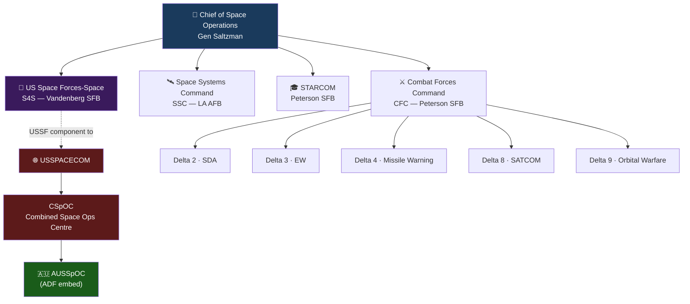

# USSF Organisation

> [!abstract] Quick Summary
> Maps the USSF organisational structure from the Chief of Space Operations down to the Field Commands and Deltas, giving ADF personnel the C2 framework needed to understand who owns what mission and who to engage with when requesting space support.

## Key Distinction

- **USSF** = service (organise, train, equip)
- **[[USSPACECOM]]** = combatant command (employs forces operationally)
- **S4S** = bridge between the two

## Leadership

- Chief of Space Operations: **Gen B. Chance Saltzman** (four-star, Joint Chiefs member)
- Members called **Guardians**
- Unit structure: **Delta** (Colonel) → **Squadron** (Maj/Lt Col) → Flight/Section/Element

> [!tip] Hot Tip
> USSF members are called Guardians, not Airmen — using the wrong term is noticed and signals a lack of preparation. Similarly, avoid calling the USSF a branch of the Air Force — it is a fully independent service. Getting this right on day one sets the tone for your embed.

## Field Commands

| Command | Mission | HQ |
| --- | --- | --- |
| **Combat Forces Command** (CFC) | Generate, present, sustain combat-ready Guardians | Peterson SFB, CO |
| **Space Systems Command** (SSC) | Develop, acquire, field space capabilities | Los Angeles AFB, CA |
| **STARCOM** | Doctrine, training, education, OT&E | Peterson SFB, CO |
| **S4S** (US Space Forces-Space) | Command combat forces; USSF component to [[USSPACECOM]] | Vandenberg SFB, CA |

> CFC was formerly SpOC, redesignated **3 November 2025**.

> [!tip] Hot Tip
> The four Field Commands own distinct parts of the mission — if you don't know which one owns your problem, start with CFC for operational force questions, S4S for anything touching CSpOC and coalition integration, and SSC only if your issue is a capability acquisition or system development matter.

## Key Deltas (under CFC)

| Delta | Mission |
| --- | --- |
| Delta 2 | [[Space Domain Awareness]] (includes [[18th Space Defense Squadron]]) |
| Delta 3 | Electromagnetic Warfare |
| Delta 4 | [[Missile Warning and Tracking\|Missile Warning]] |
| Delta 5 | C2 and CSpOC |
| Delta 6 | Cyberspace Operations |
| Delta 7 | ISR |
| Delta 8 | [[SATCOM Architecture\|Satellite Communications]] |
| Delta 9 | Orbital Warfare |

## S4S (US Space Forces-Space)

- Established **6 December 2023**; Commander dual-hatted as CJFSCC
- 2026 focus: [[USSPACECOM]] Year of Integration — operationalising integrated joint and allied space warfighting team
- Key priorities: predictive [[Space Domain Awareness|SDA]]; sustained on-orbit manoeuvre capability
- Provides support to [[ADF Space C2|AUSSpOC]]

## STARCOM

- **Delta 10**: doctrine development
- **Space Flag**: primary operational exercise
- **SWORD** (Space Warfighter Operational Readiness Domain): distributed digital training environment for SDA/satellite control/EW/orbital warfare

## USSF Growth (2026)

- Service leaders calling for USSF to **double in size**
- CFC commander: growth needed for expanding forward-operating units
- New **cyber defence squadron** established at Vandenberg SFB (March 2026)

---

> [!warning]- Constraints, Limitations and Assumptions
> **Constraints:** USSF organisational structure is still maturing — Delta assignments, command relationships, and reporting chains have changed multiple times since 2019 and may continue to evolve. Do not treat this note as authoritative without verifying against spaceforce.mil before any formal engagement or briefing.
>
> **Limitations:** The USSF is small (approximately 10,000 personnel) relative to its mission scope. It depends heavily on contracted support, intelligence community partners, and partner nation contributions — meaning the organic USSF capability visible in the org chart understates the full operational picture.
>
> **Assumptions:** Reflects the organisational structure as of March 2026. Verify currency before briefings — the pace of USSF reorganisation means a chart that was accurate six months ago may already be outdated.

**Related:** [[USSPACECOM]] · [[ADF Space C2]] · [[Space Doctrine]] · [[Coalition Space Operations]]
