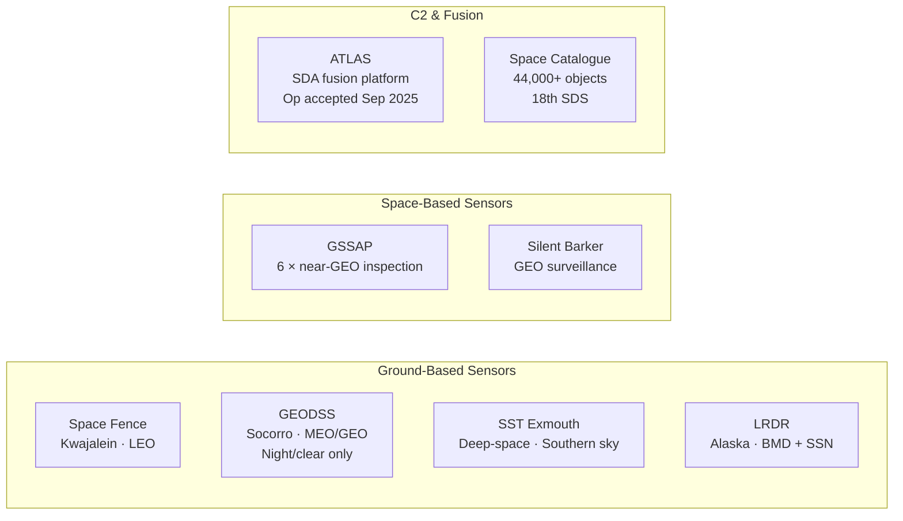

# Space Domain Awareness (SDA)

> [!abstract] Quick Summary
> Explains the four core SDA functions — detect/track/identify, characterise, threat warning, and C2 integration — and the sensor network used to maintain the space catalogue. Understanding SDA is foundational to all space operations planning and threat assessment.


    Ground --> ATLAS
    Space --> ATLAS
    ATLAS --> CAT

    style Ground fill:#1a3a5c,color:#fff
    style Space fill:#3a1a5c,color:#fff
    style C2 fill:#5c1a1a,color:#fff
```

## Core SDA Functions

1. **Detect / Track / Identify (D/T/ID)**: 44,000+ catalogued objects (2023); ~8,400 operational payloads; [[Space Fence]] detects marble-sized objects in LEO
2. **Characterisation**: understand mission type, behavioural patterns, technical capabilities, operator attribution — increasingly hard with dual-use technology and manoeuvrable satellites
3. **Threat Warning and Assessment**: conjunction events, adversary RPO, EW activity, launch detection, anomalous behaviour
4. **C2 Integration**: fuse SDA into actionable decision-support products

> [!tip] Hot Tip
> Dual-use technology makes attribution hard — a satellite with a robotic arm could be for servicing or for attacking another satellite. The USSF's threshold for publicly attributing behaviour is high; the intelligence picture is usually richer than what's stated publicly.

## Key Systems

| System | Type | Location | Notes |
| --- | --- | --- | --- |
| **[[Space Fence]]** | S-band phased-array radar | Kwajalein Atoll | Detects marble-sized objects in LEO |
| **GEODSS** | Ground-based electro-optical | Socorro NM, Maui HI, Diego Garcia | Primary MEO/GEO tracking; night/clear weather only |
| **[[SST Exmouth\|SST]]** | Wide-field telescope | Exmouth, WA (RAAF-operated) | Critical deep-space coverage of southern sky |
| **LRDR** | S-band phased-array | Clear SFS, Alaska | Primary: BMD discrimination; secondary: SSN |
| **[[GSSAP]]** | 6 near-GEO inspection satellites | Near-GEO | Primary eyes-on for GEO |
| **[[Silent Barker]]** | Space-based GEO surveillance | GEO | Next-gen persistent GEO monitoring |
| **[[ATLAS]]** | C2 and fusion platform | Multiple sites | Replaced SPADOC; operational Sep 2025 |

## 18th Space Defense Squadron

- Maintains space catalogue; issues conjunction warnings worldwide
- Operates [[ATLAS]]; assigned to Space Delta 2 under CFC
- Location: Vandenberg SFB

## Predictive SDA

Transition from **reactive** to **predictive** using AI/ML to parse sensor data, identify patterns, predict manoeuvres — key 2026 S4S priority.

> [!tip] Hot Tip
> The 2026 shift to predictive SDA using AI/ML is still maturing — current SDA products reflect the past, not necessarily what an adversary is about to do. Build in decision time accordingly.

---

> [!warning]- Constraints, Limitations and Assumptions
> **Constraints:** The unclassified space catalogue (Space-Track) lags the classified picture by design — the 18th SDS maintains objects the public catalogue does not reflect. Access to conjunction data messages (CDMs) requires Space-Track registration.
>
> **Limitations:** Objects smaller than ~10cm in LEO are not reliably tracked — these uncatalogued fragments represent a significant collision risk. GEODSS is weather and daylight dependent. Attribution of intent (hostile vs benign manoeuvre) is an analytical judgement, not a certain fact.
>
> **Assumptions:** Assumes adversaries are not actively deceiving the tracking network (e.g., stealth coatings, manoeuvring to mask intent).

---

## Knowledge Check

- [ ] Name the four core SDA functions
- [ ] Approximately how many objects are in the space catalogue?
- [ ] What is the smallest object Space Fence can detect in LEO?
- [ ] What system replaced SPADOC, and when was it declared operational?
- [ ] What is "predictive SDA" and why is it a 2026 priority?

> [!tip]- Answers *(click to reveal)*
> 1. **Detect/Track/Identify**, **Characterisation**, **Threat Warning and Assessment**, **C2 Integration**
> 2. Over **44,000 catalogued objects** (as of 2023 data in this note); the actual count including uncatalogued debris is much higher
> 3. Marble-sized objects — approximately **10 cm** in LEO
> 4. **ATLAS** (Advanced Tracking and Launch Analysis System), declared operationally accepted **September 2025**
> 5. Using AI/ML to parse sensor data, identify patterns, and **predict future manoeuvres** before they happen — shifting from reactive (responding to events) to anticipatory (warning of events in advance). Key S4S priority because the adversary threat is increasingly dynamic

> [!file] SDP 3-100 SDA Doctrine — Local Copy
> Attach a locally-saved copy of SDP 3-100 (Space Domain Awareness doctrine) in the [[Local Document Library]] using `Ctrl+P` → **Add file link**.

**Related:** [[ATLAS]] · [[Space Fence]] · [[GSSAP]] · [[Silent Barker]] · [[Counterspace Threats Overview]]
