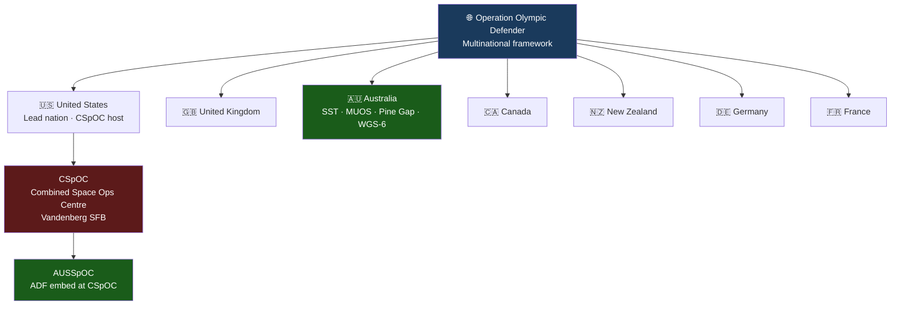

# Coalition Space Operations

> [!abstract] Quick Summary
> Describes the multinational framework for coalition space operations — centred on Operation Olympic Defender, CSpOC, and Combined Space Operations (CSpO) — and Australia's embedded role. Understanding this framework is essential for any ADF personnel deploying to or coordinating with US space organisations.

## Operation Olympic Defender (OOD)

See [[Operation Olympic Defender]] for full details.

- US-led multinational warfighting framework
- **Founding members (2020)**: US, Australia, Canada, UK
- **2024–2025 additions**: New Zealand, France, Germany
- Commander: Gen Stephen Whiting ([[USSPACECOM]])
- 2026: **Year of Integration** — operationalising fully integrated joint and allied space warfighting team

## Combined Space Operations Center (CSpOC)

- **Location**: Vandenberg SFB
- Brings together US, Australia, Canada, France, Germany, New Zealand, UK for coalition space C2
- **Space Common Operating Picture**: major coalition effort
- Representatives: [[ADF Space C2|AUSSpOC]], CANSpOC, UK NSPOC

> [!tip] Hot Tip
> Coalition space operations run on a "contribute to gain" model — ADF gets access to US capabilities (SDA picture, SATCOM, GPS protection) partly in exchange for contributing Australian assets (SST Exmouth, Pine Gap, Kojarena). Understanding what Australia contributes helps you argue for what ADF should receive in return.

---

> [!warning]- Constraints, Limitations and Assumptions
> **Constraints:** Coalition information sharing is governed by ITAR, bilateral agreements, and classification controls — not all US SDA products can be shared with all coalition partners in the same classification enclave.
>
> **Limitations:** Coalition C2 adds coordination overhead — space events that require rapid response may be slowed by consultation requirements.
>
> **Assumptions:** Assumes coalition partnerships remain politically stable — space cooperation with a partner nation depends on the broader bilateral relationship.

**Related:** [[Operation Olympic Defender]] · [[Australia Space Contribution]] · [[USSPACECOM]] · [[ADF Space C2]]
