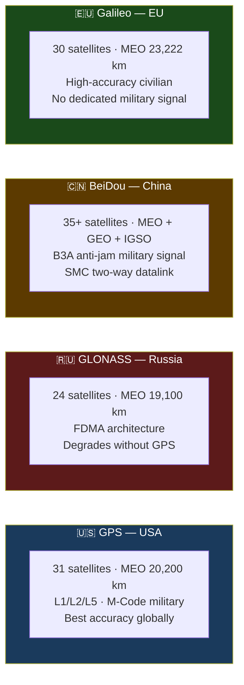

# GNSS — Four Global Constellations

> [!abstract] Quick Summary
> Compares the four major GNSS constellations — GPS (US), GLONASS (Russia), BeiDou (China), and Galileo (EU) — covering their orbital structure, signal characteristics, and strategic implications. Understanding constellation differences is essential for assessing adversary PNT resilience and planning operations under GNSS denial.

| System | Operator | Satellites | Altitude | Military Signal | Anti-Jam |
| --- | --- | --- | --- | --- | --- |
| **[[GPS]]** | USA (USSF) | 31+ | 20,200 km | M-Code (L1+L2) | Good (not fully fielded) |
| **GLONASS** | Russia | 24+ | 19,100 km | CDMA military | Limited |
| **[[BeiDou B3A and SMC\|BeiDou (BDS-3)]]** | China | 35+ (MEO+GEO+IGSO) | 21,500 km + GEO | **B3A** (freq-hop + NMA) | **Very strong** |
| **Galileo** | EU (EUSPA/ESA) | 28+ | 23,222 km | PRS (EU gov/military only) | Good (PRS) |

## Key Points

> [!tip] Hot Tip
> Modern military receivers increasingly use multi-constellation GNSS — this provides resilience if one constellation is jammed, but also means an adversary can use BeiDou to navigate while jamming GPS. Don't assume an adversary has no PNT just because GPS is jammed.

- [[GPS]] civilian L1 C/A (~−160 dBW) is the **weakest RF signal** in military architecture — 1-watt jammer denies over several km; trivially spoofed
- [[BeiDou B3A and SMC|BeiDou B3A]] frequency-hopping + NMA makes it **essentially unjammable** against current Western EW
- **GLONASS** high inclination (64.8°) gives better polar coverage than GPS (55°)
- **Galileo OSNMA** allows open-service signal authentication — reduces spoofing; model for future anti-spoofing

## ADF Relevance

- [[GPS]] primary
- Multi-constellation receivers for redundancy
- Galileo open signal available
- Galileo PRS **inaccessible** (EU only)

## The GPS Paradox

> Simultaneously the **most capable** (M-Code) and **most targeted** (due to deep dependency) GNSS system.

---

> [!warning]- Constraints, Limitations and Assumptions
> **Constraints:** BeiDou's military signals (B2b, B3A) are encrypted and not available to non-Chinese users. GLONASS accuracy has historically lagged GPS.
>
> **Limitations:** All GNSS signals are vulnerable to jamming and spoofing — signal strength at Earth's surface is approximately equivalent to a car headlight visible from 20,000 km. No constellation is inherently jam-proof.
>
> **Assumptions:** Assumes constellation operators maintain the satellite health and signal integrity — during a conflict, a nuclear detonation at MEO altitude could damage multiple constellation satellites simultaneously (Starfish Prime effect).

**Related:** [[GPS]] · [[BeiDou B3A and SMC]] · [[Operational GNSS Employment]] · [[CRPA Anti-Jam Antennas]]
