# Kill Chain Comparison

> [!abstract] Quick Summary
> Compares the kill chain architectures of Western forces, China, and Iran — highlighting how each relies on space differently and where vulnerabilities and asymmetries exist. Understanding adversary kill chains is the starting point for identifying where to apply counterspace and EW effects defensively.

```mermaid
flowchart TD
    subgraph West["🇺🇸 Western Kill Chain"]
        W1["FIND<br/>SIGINT sats · ISR · GMTI"] --> W2["FIX<br/>NGA imagery · GPS geoloc"]
        W2 --> W3["TRACK<br/>SATCOM relay · Link 16"]
        W3 --> W4["TARGET → ENGAGE<br/>GPS-guided munitions"]
        W4 --> W5["ASSESS<br/>Satellite BDA"]
    end
    subgraph China["🇨🇳 Chinese Kill Chain (ASBM)"]
        C1["FIND<br/>Yaogan SIGINT/EO<br/>OTH radar"] --> C2["FIX<br/>Electronic geolocation<br/>SAR imagery"]
        C2 --> C3["TRACK<br/>BeiDou datalink<br/>Tianlian relay"]
        C3 --> C4["TARGET → ENGAGE<br/>DF-21D/DF-26<br/>Manoeuvring RV"]
        C4 --> C5["ASSESS<br/>Satellite imagery"]
    end
    subgraph Iran["🇮🇷 Iranian Kill Chain"]
        I1["FIND<br/>Drone ISR · SIGINT<br/>Proxy reporting"] --> I2["FIX<br/>Approx coordinates"]
        I2 --> I3["TRACK<br/>Limited — static targets preferred"]
        I3 --> I4["ENGAGE<br/>Shahed · ballistic missiles<br/>GLONASS guidance"]
        I4 --> I5["ASSESS<br/>Limited BDA"]
    end

    style West fill:#1a3a5c,color:#fff
    style China fill:#5c1a1a,color:#fff
    style Iran fill:#3a3a00,color:#fff
```


## Western (Tomahawk vs Land Target)

```
Satellite imagery → GPS coordinates → SATCOM relay
  → GPS + TERCOM + DSMAC guidance → Satellite BDA
```

Depends on: [[GPS]], [[SATCOM Architecture|WGS SATCOM]], NGA imagery

## China (DF-21D/DF-26 vs Carrier Strike Group)

```
Yaogan ELINT (TDOA detect ship radar)
  → Yaogan SAR / Gaofen optical (fix)
    → ELINT/ISR updates (track)
      → BeiDou coordinates (target)
        → BeiDou mid-course + manoeuvring warhead (engage)
          → SAR/optical BDA
```

- Potentially closes in **under 30 minutes** from ELINT detection to impact
- Uses **non-Western infrastructure** ([[BeiDou B3A and SMC|BeiDou]]/Yaogan/Gaofen)

> **Key difference**: Western GPS denial has **zero effect** on China's kill chain.

## Iran (Shahed)

```
Chinese satellite ISR (find)
  → BeiDou SMC coordinates (fix/retarget)
    → BeiDou B3A + Kometa-M CRPA + INS + 4G/Starlink (engage)
```

See [[Shahed Navigation Case Study]] for detailed analysis.

## Kill Chain Time Evolution

| Era | Time |
| --- | --- |
| Desert Storm | Days |
| Iraq 2003 | Hours |
| Current (Link 16/CEC) | Minutes |
| Future (JADC2/SDA) | Seconds |

> [!tip] Hot Tip
> China's kill chain (particularly for anti-ship ballistic missiles targeting carrier groups) depends heavily on space-based ISR (Yaogan SIGINT/EO) and over-the-horizon radar for initial targeting. Disrupting their space-based find/fix capability is a legitimate defensive option, not just an offensive one.

---

> [!warning]- Constraints, Limitations and Assumptions
> **Constraints:** Kill chain assessments for China and Iran are based on open-source analysis and assessed capabilities — actual employment doctrine and integration may differ.
>
> **Limitations:** Kill chains are theoretical constructs — real-world execution depends on training, C2 resilience, and adaptation under fire.
>
> **Assumptions:** Assumes each nation employs its kill chain as assessed — in conflict, improvisation and degradation of planned systems changes the picture significantly.

**Related:** [[Space-Based Targeting]] · [[Tomahawk Guidance]] · [[Shahed Navigation Case Study]] · [[BeiDou B3A and SMC]] · [[SIGINT Satellites by Nation]]
