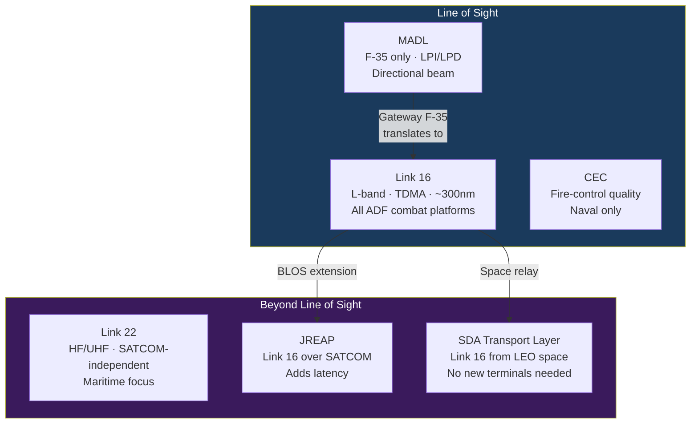

# Tactical Data Links Overview

> [!abstract] Quick Summary
> Introduces the tactical data link family — Link 16, Link 22, MADL, CEC — and the interoperability architecture that allows different platforms to share a common recognised air/surface picture. Understanding which links your platforms support, and where gaps exist, is foundational to coalition operations.

## F2T2EA — The Kill Chain

**Find → Fix → Track → Target → Engage → Assess**

- **DPI vs DMPI**: DPI (Desired Point of Impact, ±feet, required for GPS-guided weapons) vs DMPI (±hundreds feet, sufficient for unguided)
- **Track custody**: losing track means restarting from FIND; adversary EW specifically aims to break track custody by jamming data links
- Kill chain time: Desert Storm (days) → Iraq 2003 (hours) → Current Link 16/CEC (minutes) → Future JADC2/SDA (seconds)

## Data Link Summary

| Link | Band | Range | Anti-Jam | Key Feature |
| --- | --- | --- | --- | --- |
| [[Link 16]] | L-band | LOS only | Good vs NB; vulnerable to wideband | Ubiquitous; TDMA |
| [[Link 22]] | HF+UHF | **1,000+ nm BLOS** | Good | HF sky-wave; self-healing |
| [[MADL]] | Ku-band | LOS | **LPI/LPD** | F-35 only; directional |
| [[CEC and NIFC-CA\|CEC]] | — | LOS | Good | **Raw radar data**; fire-control quality |
| [[JREAP]] | Over SATCOM/IP | **BLOS** | Inherits transport | Extends Link 16 globally |
| CDL | — | LOS/SATCOM | NSA Type 1 | ISR data pipe (274 Mbps) |
| SADL | — | LOS | Limited | Air-to-ground CAS |
| TTNT | IP mesh | LOS | Good | ~10+ Mbps for NIFC-CA |
| [[SDA Transport Layer (PWSA)]] | L-band + optical | **Global** | Optical ISLs unjammable | Link 16 from space |

## ADF Link 16 Platforms

F-35A, F/A-18F, EA-18G, E-7A, P-8A, MQ-4C, Hobart-class DDG, future Hunter-class FFG

> [!tip] Hot Tip
> Link interoperability is not automatic — different data links use different message formats, frequencies, and security architectures. A coalition exercise is the time to discover gateway gaps, not a crisis. Check which links your counterpart platforms support before assuming a shared picture exists.

---

**Detailed pages:** [[Link 16]] · [[Link 22]] · [[MADL]] · [[CEC and NIFC-CA]] · [[JREAP]] · [[SDA Transport Layer (PWSA)]] · [[EW Against Data Links]]

> [!warning]- Constraints, Limitations and Assumptions
> **Constraints:** Some data link capabilities (MADL, certain CEC functions) are restricted to specific partner nations — coalition information sharing requires network design decisions made well before operations.
>
> **Limitations:** All tactical data links have capacity limits — network congestion under high-track environments (large fleet engagement) degrades track quality.
>
> **Assumptions:** Assumes ground/ship/air terminals are properly initialised with current crypto and network parameters — link failures during exercises are often due to administration, not equipment.

**Related:** [[Space-Based Targeting]] · [[Electronic Warfare Fundamentals]]
